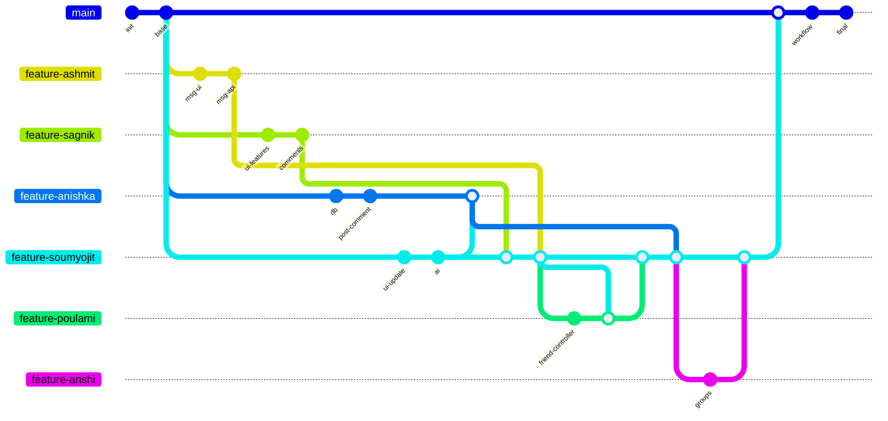

```mermaid
gitGraph
   commit id: "init"
   commit id: "base"

   branch feature-ashmit
   checkout feature-ashmit
   commit id: "msg-ui"
   commit id: "msg-api"

   checkout main
   branch feature-sagnik
   checkout feature-sagnik
   commit id: "ui-features"
   commit id: "comments"

   checkout main
   branch feature-anishka
   checkout feature-anishka
   commit id: "db"
   commit id: "post-comment"

   checkout main
   branch feature-soumyojit
   checkout feature-soumyojit
   commit id: "ui-update"
   commit id: "ai"

   checkout feature-anishka
   merge feature-soumyojit

   checkout feature-soumyojit
   merge feature-sagnik
   merge feature-ashmit

   branch feature-poulami
   checkout feature-poulami
   commit id: "friend-controller"
   merge feature-soumyojit

   checkout feature-soumyojit
   merge feature-poulami
   merge feature-anishka

   branch feature-anshi
   checkout feature-anshi
   commit id: "groups"

   checkout feature-soumyojit
   merge feature-anshi

   checkout main
   merge feature-soumyojit

   commit id: "workflow"
   commit id: "final"
```
