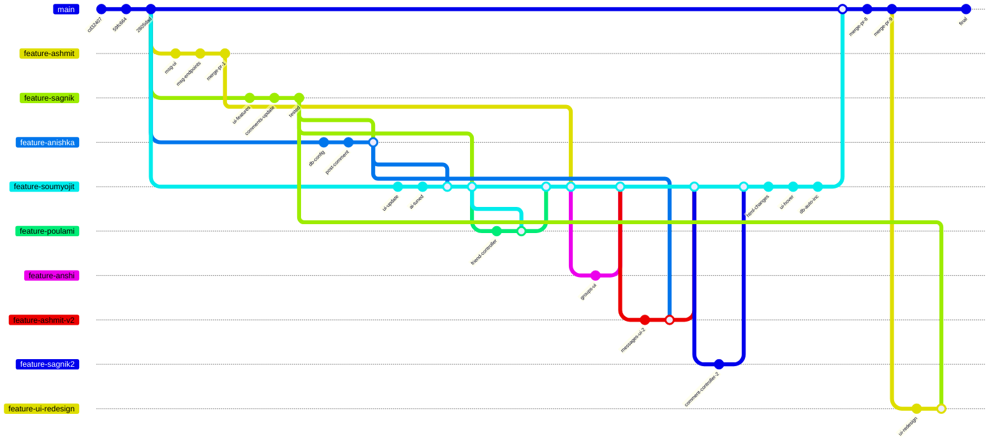

```mermaid
gitGraph
   commit id: "cd32407"
   commit id: "59fc664"
   commit id: "2805dad"

   branch feature-ashmit
   checkout feature-ashmit
   commit id: "msg-ui"
   commit id: "msg-endpoints"
   commit id: "merge-pr-1"

   checkout main

   branch feature-sagnik
   checkout feature-sagnik
   commit id: "ui-features"
   commit id: "comments-update"
   commit id: "tested"

   checkout main

   branch feature-anishka
   checkout feature-anishka
   commit id: "db-config"
   commit id: "post-comment"
   merge feature-sagnik

   checkout main

   branch feature-soumyojit
   checkout feature-soumyojit
   commit id: "ui-update"
   commit id: "ai-tuned"
   merge feature-anishka
   merge feature-sagnik

   branch feature-poulami
   checkout feature-poulami
   commit id: "friend-controller"
   merge feature-soumyojit

   checkout feature-soumyojit
   merge feature-poulami
   merge feature-ashmit

   branch feature-anshi
   checkout feature-anshi
   commit id: "groups-ui"

   checkout feature-soumyojit
   merge feature-anshi

   branch feature-ashmit-v2
   checkout feature-ashmit-v2
   commit id: "messages-ui-2"
   merge feature-anishka

   checkout feature-soumyojit
   merge feature-ashmit-v2

   branch feature-sagnik2
   checkout feature-sagnik2
   commit id: "comment-controller-2"

   checkout feature-soumyojit
   merge feature-sagnik2

   commit id: "html-changes"
   commit id: "ui-hover"
   commit id: "db-auto-inc"

   checkout main
   merge feature-soumyojit

   commit id: "merge-pr-8"
   commit id: "merge-pr-9"

   branch feature-ui-redesign
   checkout feature-ui-redesign
   commit id: "ui-redesign"
   merge feature-sagnik

   checkout main
   commit id: "final"
```
