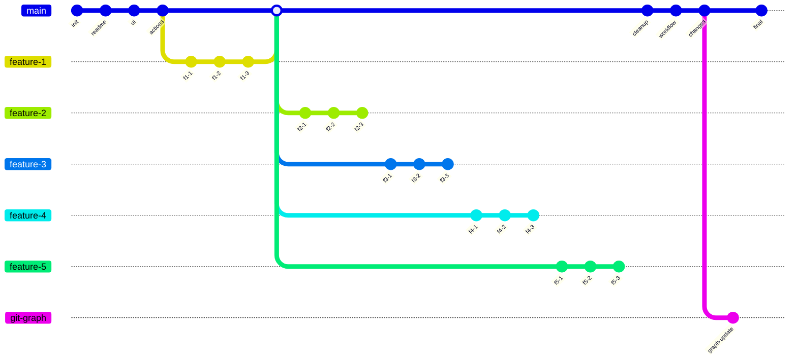

```mermaid
gitGraph
   commit id: "init"
   commit id: "readme"
   commit id: "ui"
   commit id: "actions"

   branch feature-1
   checkout feature-1
   commit id: "f1-1"
   commit id: "f1-2"
   commit id: "f1-3"

   checkout main
   merge feature-1

   branch feature-2
   checkout feature-2
   commit id: "f2-1"
   commit id: "f2-2"
   commit id: "f2-3"

   checkout main

   branch feature-3
   checkout feature-3
   commit id: "f3-1"
   commit id: "f3-2"
   commit id: "f3-3"

   checkout main

   branch feature-4
   checkout feature-4
   commit id: "f4-1"
   commit id: "f4-2"
   commit id: "f4-3"

   checkout main

   branch feature-5
   checkout feature-5
   commit id: "f5-1"
   commit id: "f5-2"
   commit id: "f5-3"

   checkout main

   commit id: "cleanup"
   commit id: "workflow"
   commit id: "changes"

   branch git-graph
   checkout git-graph
   commit id: "graph-update"

   checkout main
   commit id: "final"
```
